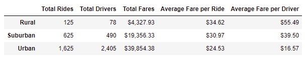

# PyBer Ride-Sharing Analysis Challenge
## Project Overview:

The data analytics team was assigned to create a summary DataFrame of the ride-sharing data by city type. Additionally, the team was tasked to create a multiple-line graph that shows the total weekly fares for each city type. Following the analysis, the data analytics team has concluded that PyBer needs to conduct further market research to understand the demand for ride sharing in each city type, with particular attention on rural cities, and, depending on the results of market research, intervene in the number of available drivers in the city types. The following results were achieved using Pandas and MatplotLib modules in Python on Jupyter Notebooks. 

## Results:
The following summary DataFrame of the ride-sharing data by city type demonstrates a significant disparity between each city type.
### PyBer Summary DataFrame:

The following line chart visualizes the difference in weekly fares by city type. Please note that each week marks a peak or a dip of the lines. 
### PyBer Weekly Fare Summary Plot: 

## Summary:
Although there is a significant disparity in the number of drivers, rides, fares, and averages between the city types, the line chart shows an overall similar trend in the weekly fares among the city types. Given this observation, the data analytics team recommends the following actions: 
  1. Conduct market research and provide the data analytics team with further data to deeper understand the dynamics of the market and the demand in each city type. 
  2. Following the analysis of the market, intervene in the number of drivers, preferrably increasing the number of drivers in the rural areas. The comparison of average fares per rides and average fares per drivers suggests that there is a lack of drivers in the rural and suburban city types. The most significant disparity between average fares per ride and per driver is in the rural type. Such an intereference, however, must be supported by further evidence, as pointed in Recommendation 1 above. 
  3. Finally, it is necessary to intervene and support the drivers in the urban city types. As the summary dataframe indicates, there is higher supply of drivers than there is a demand for them. If there is sufficient further evidence from market research, reduce the number of drivers in the urban types by reassigning them to suburban or rural types where possible. 
